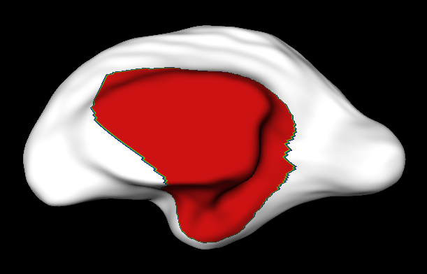
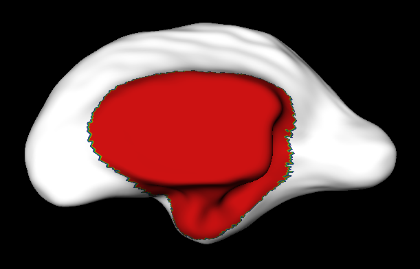

# Surface Data Registration

[](https://hub.docker.com/r/fnndsc/pl-bestsurfreg-surface-resample)
[](https://github.com/FNNDSC/pl-bestsurfreg-surface-resample/blob/main/LICENSE)
[](https://github.com/FNNDSC/pl-bestsurfreg-surface-resample/actions/workflows/ci.yml)

`pl-bestsurfreg-surface-resample` is a [_ChRIS_](https://chrisproject.org/)
_ds_ plugin which does surface registration using MNI/CIVET tools.
The inputs are MNI `.obj` surfaces of either the left or right brain hemisphere.
For each surface, the registered vertex-wise data is produced as a `.txt` file,
as well as the intermediate `.sm` registration map file.

In its default configuration, it uses the average 29 gestational age
fetal brain template of the [Im Lab](https://research.childrenshospital.org/neuroim/)
to register a mask of the medial cut.




Figure: (Left) mask does not cover medial cut. (Right) mask is registered to cover the medial cut.

## Installation

`pl-bestsurfreg-surface-resample` is a _[ChRIS](https://chrisproject.org/) plugin_, meaning it can
run from either within _ChRIS_ or the command-line.

[](https://chrisstore.co/plugin/pl-bestsurfreg-surface-resample)

## Local Usage

To get started with local command-line usage, use [Apptainer](https://apptainer.org/)
(a.k.a. Singularity) to run `pl-bestsurfreg-surface-resample` as a container:

```shell
apptainer exec docker://fnndsc/pl-bestsurfreg-surface-resample bsrr [--args values...] input/ output/
```

To print its available options, run:

```shell
apptainer exec docker://fnndsc/pl-bestsurfreg-surface-resample bsrr --help
```
